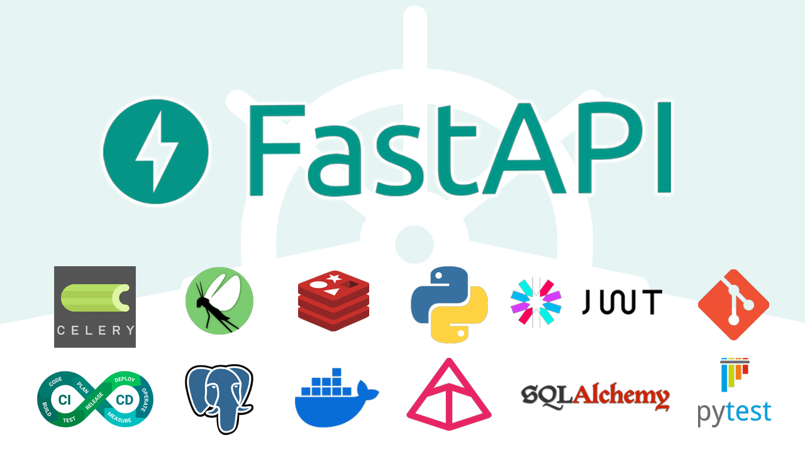

  
  <h1 align="center">
    FastAPI Advanced Tutorial Project
  </h1>

The full course can be found <a href="https://thealibigdeli.ir/courses"> https://thealibigdeli.ir</a>.

# Guideline
- [Guideline](#guideline)
- [Introduction](#introduction)
- [Curriculum](#curriculum)

# Introduction

This repository includes all the source code and whatever we used in the tutorial, and will be here as a reference for students to keep looking for further projects.

# Curriculum
Below you can find all the subjects that we talked about in this tutorial:

- Introduction of the course
- Setup FastAPI Models with SQLAlchemy and Alembic
- Implement API Routes using FastAPI
- FastAPI Dependency Injection
- OpenAPI Documentation with Swagger and ReDoc
- Authentication API (apikey,token auth, JWT)
- Reformat and Lint (flake8, black)
- Writing Tests with PyTest
- Populate Database with Faker and Custom Commands
- CORS Headers Configuration
- Setting up project with Docker (Dockerfile/docker-compose)
- Load Testing with Locust
- Background Tasks with Celery and Redis
- Caching with Redis
- Get Ready for Deployment (Uvicorn, Nginx)
- CI/CD with GitHub Actions

